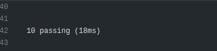
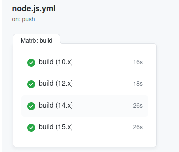
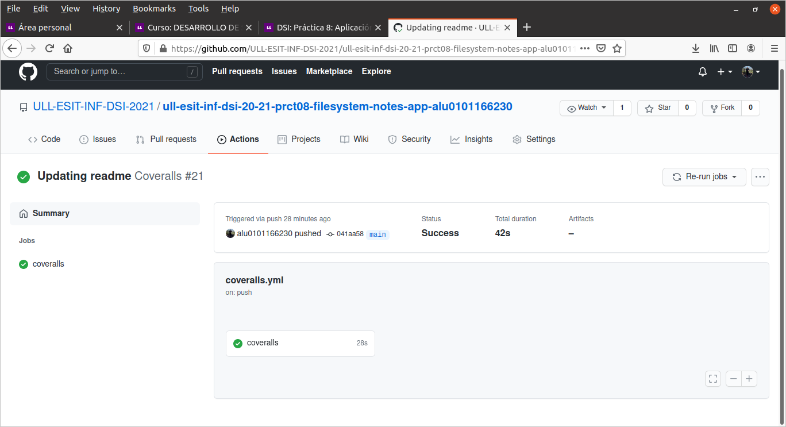
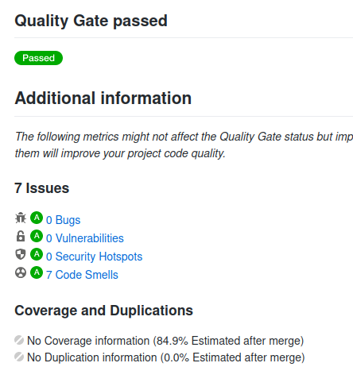

# Práctica 8 - Aplicación de procesamiento de notas de texto

## Escuela superior de ingeniería informática

### Desarrollo de Sistemas Informáticos

#### Leonardo Dorta Bejarano 
##### [alu0101166230@ull.edu.es](alu0101166230@ull.edu.es)

## Introducción

Mediante el [Enunciado de la Práctica](https://ull-esit-inf-dsi-2021.github.io/prct08-filesystem-notes-app/), se pretende realizar una aplicación de procesamiento de notas de texto. La cual permitirá realizar las siguientes acciones para las notas de un usuario concreto:

- Añadir 
- Modificar
- Eliminar
- Listar  


El propósito de este informe será dar a conocer la implementación de dicha aplicación Además de eso, pretende ser una guía para que cualquier persona interesada en replicar dicha aplicación

## Objetivos 

Los objetivos de este informe son:

1. Relizar dicha aplicación, con las interaciones ya mencionadas

2. Utilzar para ello Node.js, en concreto, la API síncrona proporcionada por Node.js para trabajar con el sistema de ficheros. Además del uso de yargs.js y chalk.js

3. Dar a conocer la implementación de esta aplicación

4.  Utilizar [Typedoc](https://typedoc.org/) para documentar el código

5. Realizar los ejercicio usando TDD mediante [Mocha](https://mochajs.org/) y [Chai](https://www.chaijs.com/) 

6. Mediante la herramienta [Istanbul.js](https://www.npmjs.com/package/istanbul), cubrir mediante las pruebas el mayor porcentaje del código

7. Respetar los principios SOLID

8. Utilizar las siguiente Github Action:
    - CI for Node.js
    - SonarCloud
    - Coverall

9. Utilizar los paquetes yargs y chalk
## Metodología

Para realizar la práctica, y este informe, se uso la siguiente metodología:

Para cada ejercicio:

1. Se configuró apropiadamente el entorno

2. Al hacer TDD, debemos de escribir las pruebas primero. Estas deben de fallar.

3. Se escribe el código. Esperando a que pase todas las pruebas implementadas

4. En caso de que sea necesario, se retoca el código.

5. Mediante [Typedoc](https://typedoc.org/) se genera la documentación para las funciones y los tipos

6. Verificar mediante [Istambul](https://istanbul.js.org/) el cubrimiento del código

7. Mediante [Github Action](https://github.com/features/actions) se realiza integración continua de todos los test, en las diferentes versiones de Node.js cubrimiento del código

8. Se generó este informe


### Implementación.

1. **Add note**

Para añadir una nota, se ejecuta el comando

```ts
 
add --user Leonardo --title MyNote --body thisIsMyContent --color red

```
Si existe, esta es la salida

 Se crea una carpeta con el usuario y la nota dentro
 

 

Si ya existe, muestra un mensaje de error

2. **Modify Note**

Se ejecuta de la siguiente manera

```ts
 modify --user Leonardo --title MyNote --body changing --color yellow

```

Si Existe la note:

 

Efectivamente se cambia
  

Si no existe


3. **Remove Note**


Efectivamente borra el fichero


En caso de que no exista


4. **List Notes**

Dado un usuario con notas


Se muestra efectivamente por su `--color`

En caso de que no exista, se muestra el siguiente mensaje


5. **Read Note**

Ejecución:


Podemos ver que efectivamente se muestrael color guardado.

En caso de que no exista, la salida es la siguiente


  **Carga y Guarda en formato JSON**


#### Test implementados


  
#### Cubrimiento del Código mediante Instanbul


### Github Actions

#### Node.js 


 

#### Coveralls
 

#### SonarCloud 



### Conclusiones

Realizando esta práctica, se pudo realizar la aplicación de procesamiento de notas de texto. La cual permitirá realizar acciones como 

- Añadir 
- Modificar
- Eliminar
- Listar  

Mediante pasing de JSON, asi como tambien las Herramientas de yargs y chalk

### Problemáticas

La principal problemática encontrada fue la instalación del sonar cloud, asi tambien como el uso de chalk y yarg
### Referencias

- [Práctica 8 - Aplicación de procesamiento de notas de texto](https://ull-esit-inf-dsi-2021.github.io/prct08-filesystem-notes-app/)
- [Typedoc](https://typedoc.org/)
- [Mocha](https://mochajs.org/) 
- [Chai](https://www.chaijs.com/) 
- [Typescript Documentación oficial](https://www.typescriptlang.org/)
- [Istambul](https://istanbul.js.org/)
- [Github Action](https://github.com/features/actions)
-  [API síncrona proporcionada por Node.js para trabajar con el sistema de ficheros.](https://nodejs.org/dist/latest-v15.x/docs/api/fs.html#fs_synchronous_api)
-  [Yarg](https://www.npmjs.com/package/yargs)
-  [Chalk](https://www.npmjs.com/package/chalk)
